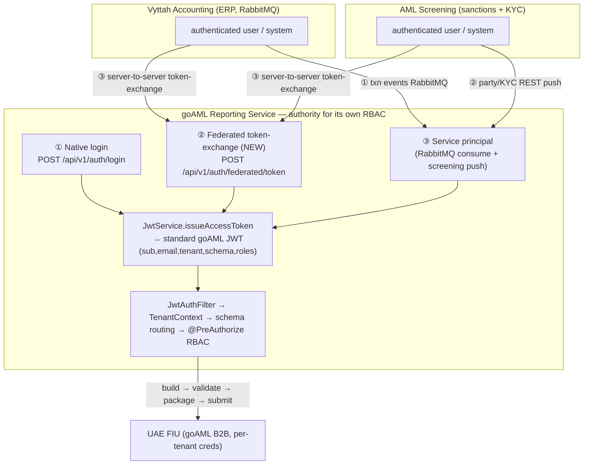

# Architecture — goAML in the Vyttah Suite: integration & unified auth

> Durable design record (refined via Ultraplan, 2026-06-04). **Documentation only — no app/build/migration
> code here.** The integration + federated-auth code is **Phase 1.5**, built after the standalone core.
> Live status: [../STATE.md](../STATE.md) · decisions: [../PROJECT.md](../PROJECT.md) · roadmap: [../ROADMAP.md](../ROADMAP.md).

---

## 1. Why this exists

goAML is built to be **sold standalone** *and* run **inside Vyttah's microservice suite** alongside:
- **Vyttah Accounting/ERP** — the gold dealer's books (transactions, cash, metals, counterparties); has **RabbitMQ**.
- **AML Screening** — sanctions screening + KYC (party/director identity, match results).

This records (a) how goAML sits relative to those two systems, (b) the auto-reporting integration
(**Phase 1.5**), and (c) the **unified authentication** approach across three apps that today have
separate logins — plus the fact that the FIU's goAML B2B submission credentials are separate again.

## 2. Locked decisions

- **goAML = its own dedicated microservice** ("Regulatory Reporting Service"); sellable standalone AND
  integrated. Not merged into accounting or screening.
- **Bounded contexts:** Accounting owns transactions/financials; Screening owns KYC + sanctions; goAML owns
  reports, validation, FIU submission, filing audit. **Reportability detection lives in goAML.**
- **Integration transport:** RabbitMQ (already in accounting) for events; REST/API for screening → Phase 1.5.
- **Unified auth:** goAML **keeps its own JWT and stays the identity authority.** Accounting/Screening
  authenticate their own user, then call a goAML **token-exchange** endpoint (service-to-service trust) to
  obtain a goAML JWT. goAML **stores external-identity links** to resolve those users. **No external IdP**
  (Keycloak/Cognito rejected).
- **Standalone auth is configurable per deployment:** `goaml.auth.mode = native | federated | both`.
- **Auto-submit safety:** accounting events auto-create a **validated DPMSR draft → MLRO 1-click approve**;
  fully-automatic submission is an explicit **per-tenant opt-in** (`tenant_goaml_config.auto_submit`,
  default false) with guardrails.
- **FIU B2B credentials are separate from all user login** — per-tenant, in AWS Secrets Manager
  (`tenant_goaml_config.secrets_path`); a tenant's users all submit under that tenant's single FIU identity.

## 3. Suite topology + auth on-ramps

**Principle:** three on-ramps, but every path ends at the **existing standard goAML JWT** (claims
`sub, email, tenant, schema, roles`), so everything downstream (`JwtAuthFilter` → `TenantContext` → schema
routing → RBAC) is **unchanged**. goAML stays authoritative for its own RBAC.

## 4. The three auth on-ramps

1. **Native login** (exists, unchanged): `POST /api/v1/auth/login` (email+password → JWT). Standalone +
   direct goAML users.
2. **Federated token-exchange** (NEW, Phase 1.5): `POST /api/v1/auth/federated/token`, called
   server-to-server by accounting/screening *after they authenticate their own user*. Request carries:
   - **trusted-service credential** — preferred: a **signed service assertion** (caller signs a short-lived
     JWT with its registered key; goAML verifies against that source's registered public key; simpler
     fallback = a per-source service API key); and
   - the **external user identity** (source system + external user id/email + tenant/org ref, optional role
     hints).
   goAML verifies the service, resolves external identity → a goAML `app_user` + tenant (just-in-time
   provision if configured), and issues a goAML JWT via the existing `JwtService`. Lightweight RFC-8693-style
   exchange, self-implemented, **no external IdP**.
3. **Service principal** (machine, no user): the same trusted-service credential authorizes RabbitMQ
   consumption + the screening data-push API, acting as a tenant-scoped **system** actor (audited as such).

## 5. Data model (Phase 1.5 — `src/main/resources/db/migration/shared/V3__federated_identity.sql`)

- `external_identity(id, source_system [ACCOUNTING|SCREENING], external_user_id, external_email,
  app_user_id FK → app_user, created_at)`, unique `(source_system, external_user_id)`. (This is "store the
  accounting & screening users to validate.")
- `trusted_service` (or config-driven to start): `source_system`, public key / API key, allowed tenant scope.
- Tenant mapping: an `external_org_ref` per source (column on the tenant table or a small mapping table) so
  an exchange resolves to the correct goAML tenant.
- `tenant_goaml_config.auto_submit BOOLEAN DEFAULT false` (full-auto opt-in flag).

> Migration lives under the **shared** schema (`db/migration/shared/`), matching the repo's split shared vs
> tenant Flyway locations. There is no `tenant_goaml_config` table yet — it arrives with Phase 6/1.5.

## 6. Phase 1.5 — Accounting + Screening integration

- **Accounting → goAML (RabbitMQ):** consume transaction-created events → `ReportabilityDetector`
  (goAML-owned rules: cash ≥ AED 55,000, precious metals, not exempt — see DPMSR triggers in
  [../discussion-log.md](../discussion-log.md) topic 11) → **auto-create a validated DPMSR draft** → notify
  MLRO → **1-click approve → submit**. Full-auto submit is the per-tenant `auto_submit` flag, off by
  default. Idempotent on `entity_reference`.
- **Screening → goAML (API + form):** screening pushes **party / director / KYC** via REST
  (service-credential auth) to create/enrich a report and produce XML; also a **UI form** for manual entry.
  (Sanctions confirmed/partial match → CNMRA/PNMRA in a later phase.)
- Reuses the engine (builders/validator/marshaller) + b2b client; new `ingestion/` package.

## 7. Phase 1.5 Spring touchpoints (recorded, not built now)

Extend `security/SecurityConfig.java` (permit the federated endpoint behind a service-credential filter,
keep `JwtAuthFilter` for user JWTs); reuse `security/JwtService.java` to issue tokens; add
`web/auth/FederatedTokenController.java` + `security/ServiceCredentialValidator.java`; add
`persistence/shared/ExternalIdentityEntity.java` + repo; add the V3 shared migration. **No**
`spring-boot-starter-oauth2-resource-server` (we keep our own JWT). Add `spring-boot-starter-amqp` for the
RabbitMQ consumer; new `ingestion/` package (accounting consumer + `ReportabilityDetector` +
auto-create→approve; screening REST push + UI form).

## 8. Sequencing (note the "1.5" label)

1. **XSD-first foundation** (immediate; [xsd-first-foundation.md](xsd-first-foundation.md)).
2. **goAML standalone core** (Phases 6–14): AWS + B2B client → submission → tracking → web/UI. Native auth.
   Makes goAML sellable standalone.
3. **Phase 1.5** — federated auth + `ingestion/`. **Despite the "1.5" label it is sequenced last**, because
   it depends on the engine, the b2b client, and submission already existing.

## 9. Verified against the code (Ultraplan, 2026-06-04)

All referenced code exists and matches: `JwtService` issues HS256 JWTs with exactly `sub/email/tenant/
schema/roles`; `SecurityConfig` is stateless, permits `/api/v1/auth/**` + actuator, chains `JwtAuthFilter`
before `UsernamePasswordAuthenticationFilter`, `@EnableMethodSecurity` on; `AuthController` exposes
`POST /api/v1/auth/login`; migrations are split `db/migration/shared/{V1,V2}` + `tenant/V1`; `build.gradle`
has security+jjwt+JAXB and **no** amqp/oauth2 (both are Phase 1.5 adds). Phases 1–5 are committed; next is
Phase 6 (AWS + B2B client).
