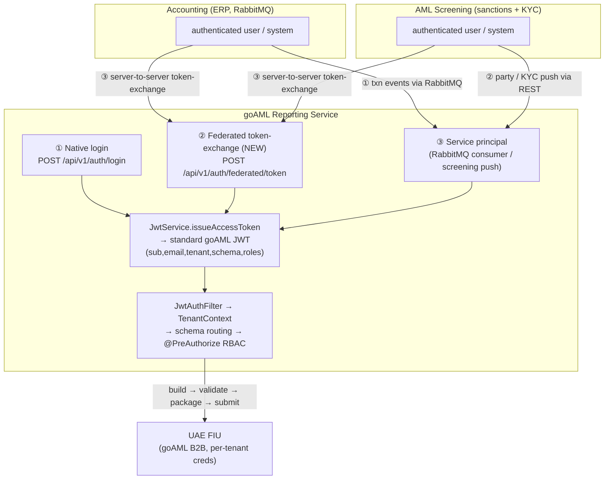

# goAML Suite Positioning, Phase 1.5 Integration & Unified Authentication

> Architecture & decision record (drafted locally, refined + **approved via Ultraplan** 2026-06-04, then
> merged with the local knowledge base). Captures the design **now**; the code described here is built in
> **Phase 1.5** (scheduled after the standalone core — see [`../ROADMAP.md`](../ROADMAP.md)).
> **This document changes no application code by itself.**
> Related: [`../STATE.md`](../STATE.md) · [`../PROJECT.md`](../PROJECT.md) ·
> [`xsd-first-foundation.md`](xsd-first-foundation.md) · DPMSR triggers in
> [`../discussion-log.md`](../discussion-log.md) (topic 11).

## 1. Where goAML sits in the Vyttah suite

goAML is being built two ways at once:

1. **A standalone, sellable product** — a multi-tenant compliance platform that builds, validates,
   submits, and tracks goAML reports to the UAE FIU via the goAML Web B2B REST interface (full manual
   data entry → XML → validate → submit, on its own).
2. **A service inside the Vyttah microservice suite**, alongside two sibling systems:
   - **Accounting / ERP** — the gold dealer's books. Already runs **RabbitMQ**. Source of the
     transactions that may become reportable (e.g. DPMSR — dealers in precious metals & stones).
   - **AML Screening** — sanctions screening + KYC. Source of party/customer identity and risk data.

**Decision — goAML is its own dedicated microservice** (the "Regulatory Reporting Service"). It is **not**
merged into accounting or screening. The same codebase serves both the standalone product and the
integrated suite service; integration is additive and optional.

### Bounded contexts (who owns what)

| Context | Owns |
|---|---|
| **Accounting** | Transactions, financials, the books |
| **Screening** | KYC, customer/party identity, sanctions screening, risk |
| **goAML (this service)** | Reports, **reportability detection**, validation, FIU submission, filing audit/tracking |

Reportability detection — deciding that an accounting event crosses a goAML reporting threshold — **lives
in goAML**, not in accounting. Accounting just emits business events; goAML decides what is reportable
(the DPMSR triggers: cash ≥ AED 55,000 in precious metals, not exempt — see discussion-log topic 11).

## 2. The authentication problem

Today the three apps each have **their own separate login**. We want a unified experience without standing
up a heavyweight external identity provider, and we must not disturb goAML's existing, working JWT + RBAC +
schema-per-tenant security.

There is also a **fourth, separate** credential that is often confused with user login:

> **FIU goAML B2B submission credentials are NOT user logins.** They are per-tenant machine credentials
> issued by the FIU, used only for server-to-server report submission. All of a tenant's users submit
> under that tenant's **single** FIU identity. They live in AWS Secrets Manager
> (`tenant_goaml_config.secrets_path`), never mixed with app-user authentication. (This is the "goaml
> creds will be different" the developer flagged.)

### Decision — goAML remains its own identity authority

goAML **keeps its own JWT** and stays the authority for its own RBAC and tenant routing. We do **not** adopt
an external IdP (Keycloak/Cognito were considered and **rejected**). Instead, the sibling systems
authenticate their own user and then **exchange** that for a goAML token.

### Three on-ramps, one token

Every authentication path converges on the **existing standard goAML JWT** (issued by
`security/JwtService.java`, claims `sub, email, tenant, schema, roles`). Everything downstream —
`JwtAuthFilter` → `TenantContext` → schema routing → `@PreAuthorize` RBAC — is therefore **unchanged**.



1. **Native login** — the existing `POST /api/v1/auth/login` (email + password → goAML JWT). Used by the
   standalone product and by users logging into goAML directly.
2. **Federated token-exchange (NEW, Phase 1.5)** — accounting/screening authenticate their own user, then
   call goAML server-to-server to mint a goAML JWT for that user.
3. **Service principal** — the background integrations (RabbitMQ consumer, screening push) act under a
   tenant-scoped service identity to create drafts and route to the right tenant (audited as "system").

### Decision — per-deployment auth mode

A single config flag makes the same binary serve both worlds:

```
goaml.auth.mode = native | federated | both
```

- `native` — standalone deployments; only `/api/v1/auth/login`.
- `federated` — locked-down suite deployments; only token-exchange.
- `both` — suite deployments that still allow direct goAML logins.

## 3. Federated token-exchange — design (Phase 1.5)

**Endpoint:** `POST /api/v1/auth/federated/token`, called **server-to-server** by accounting/screening
**after** they have authenticated their own user. A lightweight, self-implemented, RFC 8693-style exchange —
no external IdP.

**Request carries two things:**

1. **A trusted-service credential** proving the *calling system* is allowed to mint goAML tokens.
   - **Preferred:** a **signed service assertion** — the caller signs a short-lived JWT with its registered
     private key; goAML verifies against that source's registered public key.
   - **Simpler fallback for the first cut:** a per-source **service API key**.
2. **The external user identity** — source system (`ACCOUNTING` | `SCREENING`), external user id/email, the
   tenant/org reference, and optional role hints.

**goAML then:**

1. Verifies the trusted-service credential.
2. Resolves the external identity → a goAML `app_user` + tenant (just-in-time provisioning if configured).
3. Issues a standard goAML JWT via the existing `JwtService` — same claims, same downstream handling.
   goAML remains authoritative for the user's RBAC roles (the source's role hints are advisory).

## 4. Data model additions (Phase 1.5)

Migration: **`src/main/resources/db/migration/shared/V3__federated_identity.sql`** (shared schema — this is
cross-tenant identity infrastructure, alongside the existing `shared/V1__baseline` + `shared/V2__shared_core`
and `tenant/V1__tenant_init`).

- **`external_identity`** — `(id, source_system [ACCOUNTING|SCREENING], external_user_id, external_email,
  app_user_id FK → app_user, created_at)`, unique on `(source_system, external_user_id)`. Maps a sibling
  system's user to a goAML app user. (This is "store the accounting & screening users to validate.")
- **`trusted_service`** — registered sources allowed to call token-exchange: `source_system`, public key /
  API key, allowed tenant scope. (May start config-driven and graduate to a table.)
- **Tenant mapping** — an `external_org_ref` per source (column on the tenant table or a small mapping
  table) so an exchange resolves to the correct goAML tenant.
- **`tenant_goaml_config.auto_submit BOOLEAN DEFAULT false`** — the full-auto opt-in flag (see §6). That
  table also holds the FIU `secrets_path` (per §5). Note: `tenant_goaml_config` itself first appears with
  Phase 6 — the `auto_submit` column is added when 1.5 lands.

## 5. FIU B2B credentials vs. user login (kept strictly separate)

- FIU B2B credentials are **per-tenant**, stored in **AWS Secrets Manager**, referenced by
  `tenant_goaml_config.secrets_path`.
- They authenticate the **submission channel** to the FIU, not any human.
- A tenant's users all submit under that tenant's **single** FIU identity.
- They never participate in app-user authentication or the federated exchange.

## 6. Auto-submission safety model

Integration must not let an accounting event silently file a regulatory report.

- **Default path:** an accounting event auto-creates a **validated DPMSR draft**, which an **MLRO** approves
  with **one click** to submit.
- **Fully-automatic submission** (no human in the loop) is an explicit **per-tenant opt-in**
  (`tenant_goaml_config.auto_submit`, default `false`) with guardrails: validate-before-submit, idempotency
  on `entity_reference`, full audit.

## 7. Phase 1.5 — ingestion & integration

- **Accounting → goAML (RabbitMQ):** consume transaction-created events → `ReportabilityDetector`
  (goAML-owned rules) → auto-create validated DPMSR draft → notify MLRO → 1-click approve → submit.
- **Screening → goAML (REST + UI form):** screening pushes party/director/KYC via REST (service-credential
  auth) to create/enrich a report and produce XML; also a UI form for manual entry. (Sanctions
  confirmed/partial match → CNMRA/PNMRA in a later phase.)
- Reuses the engine (builders/validator/marshaller) + the b2b client; new `ingestion/` package.

## 8. Spring / code touchpoints for Phase 1.5 (recorded, not built now)

- **`security/SecurityConfig.java`** — permit `/api/v1/auth/federated/**` behind a service-credential
  filter; keep `JwtAuthFilter` for user JWTs. **Do not** add the oauth2 resource-server starter — we keep
  our own JWT.
- **`security/JwtService.java`** — reused as-is to issue the exchanged token.
- **New:** `web/auth/FederatedTokenController.java`, `security/ServiceCredentialValidator.java`,
  `persistence/shared/ExternalIdentityEntity.java` + repository.
- **New migration:** `db/migration/shared/V3__federated_identity.sql`.
- **Ingestion:** add `spring-boot-starter-amqp`; new **`ingestion/`** package — accounting RabbitMQ consumer
  + `ReportabilityDetector` + auto-create→approve flow; screening REST push endpoint + UI form.

Verified against the code (2026-06-04): `JwtService` issues HS256 JWTs with exactly
`sub/email/tenant/schema/roles`; `SecurityConfig` is stateless, permits `/api/v1/auth/**` + actuator, chains
`JwtAuthFilter` before `UsernamePasswordAuthenticationFilter`, `@EnableMethodSecurity` on; `AuthController`
exposes `POST /api/v1/auth/login`; migrations are split `shared/{V1,V2}` + `tenant/V1`; `build.gradle` has
security+jjwt+JAXB and **no** amqp/oauth2 (both are Phase 1.5 adds).

## 9. Sequencing — note the "1.5" label

1. **XSD-first foundation** — immediate; tracked in [`xsd-first-foundation.md`](xsd-first-foundation.md)
   (build the domain over the real goAML 5.0.2 XSD).
2. **Standalone core** — Phases 6–14 (AWS + B2B client → submission → tracking → web/UI). Native auth.
   Makes goAML sellable standalone.
3. **Phase 1.5 — integration + federated auth + `ingestion/`.** *Despite the "1.5" label, it is sequenced
   last*, because it depends on the engine, the B2B client, and submission already existing.

## 10. Acceptance criteria (for the future Phase 1.5 build)

- An accounting RabbitMQ event produces a **validated DPMSR draft** → MLRO **one-click** submit → FIU
  reportkey recorded + audit trail.
- An accounting/screening user hits `POST /api/v1/auth/federated/token` and receives a valid goAML JWT that
  routes to the **correct tenant schema** with the correct roles.
- A standalone deployment with `goaml.auth.mode=native` still logs in via `/api/v1/auth/login`, unchanged.
- Multi-tenant isolation holds across every surface and every auth on-ramp; the existing JWT/RBAC/audit
  foundation is **additively** extended, never disturbed.
